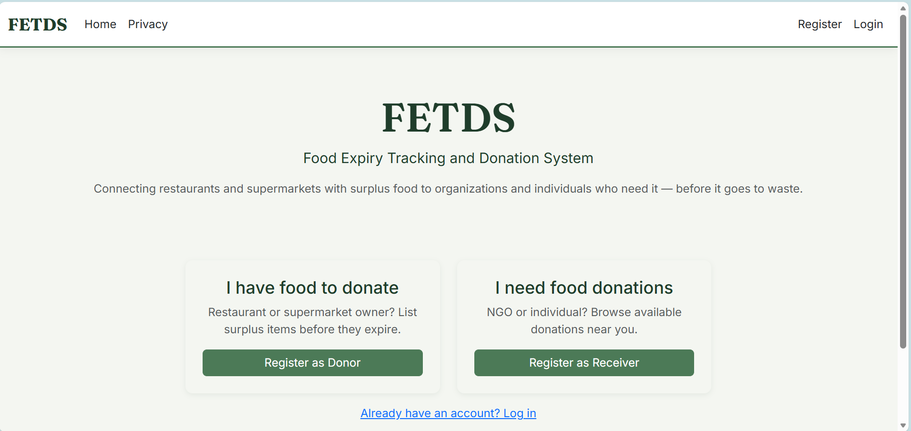
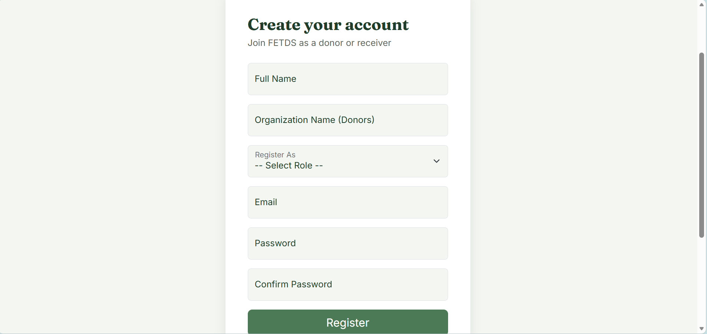
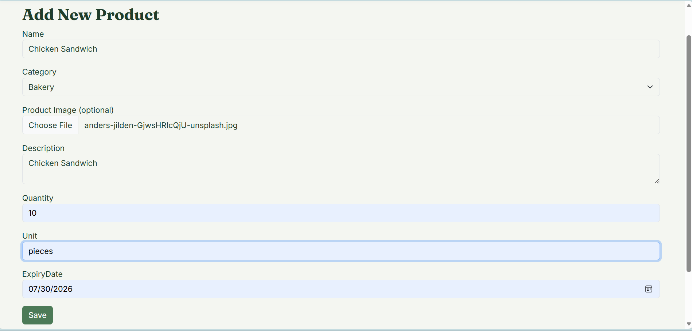
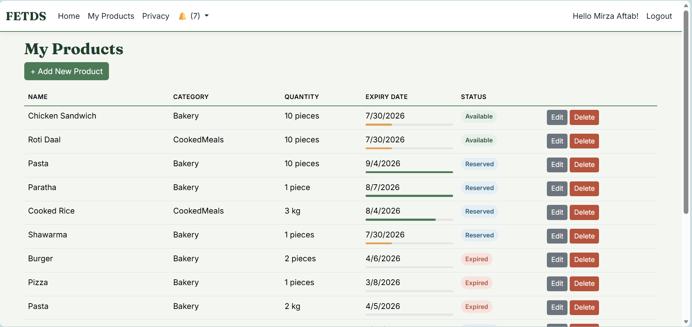
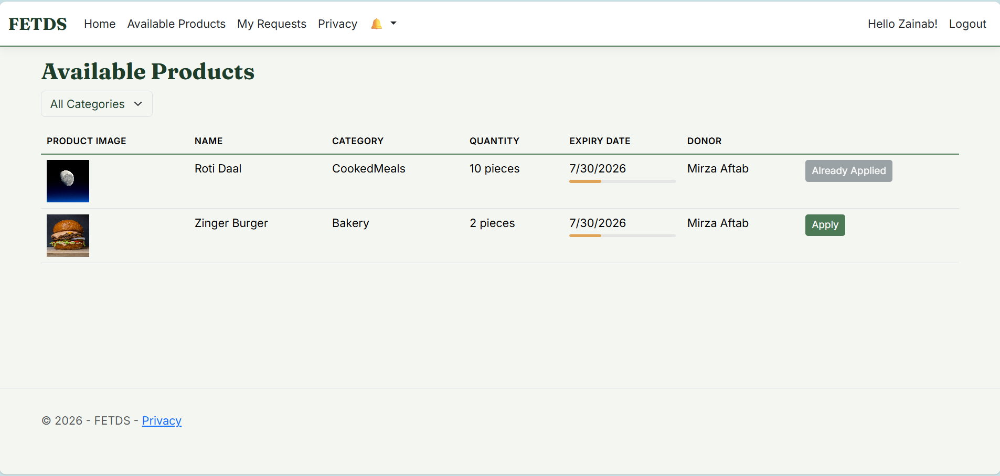
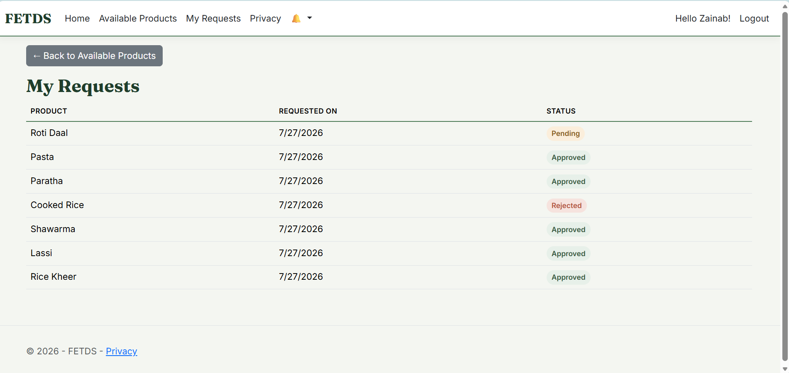
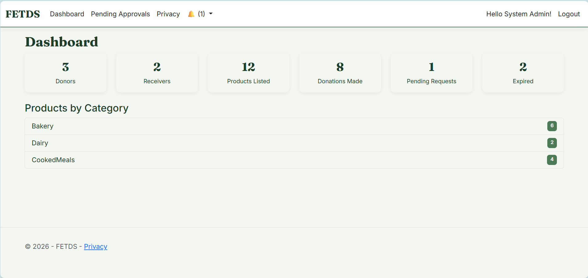
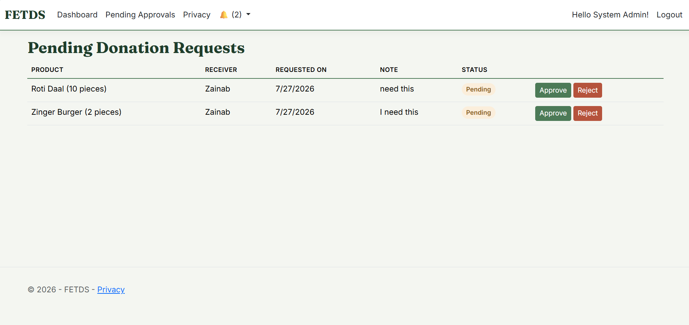
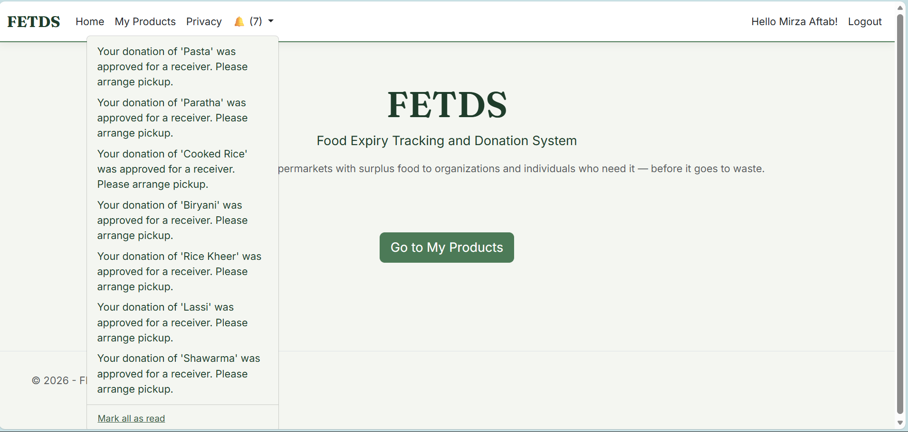

# 🥗 FETDS — Food Expiry Tracking and Donation System

**Connecting surplus food with the people who need it — before it goes to waste.**

FETDS is a role-based web platform where restaurants and supermarkets list surplus food nearing expiry, NGOs and individuals apply to receive it, and an admin reviews each match before it's confirmed. Built as a hands-on learning project to practice real-world ASP.NET Core MVC patterns end to end.

---

## 📖 Table of Contents

- [Features](#-features)
- [Tech Stack](#-tech-stack)
- [Screenshots](#-screenshots)
- [Getting Started](#-getting-started)
- [How the Core Workflow Works](#-how-the-core-workflow-works)
- [Future Improvements](#-future-improvements)
---

## ✨ Features

- 🔐 **Role-based accounts** (Donor / Receiver / Admin) via ASP.NET Core Identity, with a custom `ApplicationUser` profile
- 🍞 **Donors** list, edit, and delete surplus food with quantity, category, expiry date, and an optional photo
- 🔎 **Receivers** browse available listings — filterable by category, with a live freshness indicator per item — and apply for what they need
- ✅ **Admins** review pending requests and approve or reject them; approving one request automatically rejects competing requests for the same item
- 🔔 **In-app notifications** for donors and receivers on approval/rejection, and for admins when a new request needs review
- ⏰ **Automatic expiry handling** — listings past their expiry date are hidden from the available list without any manual cleanup
- 🎨 A custom visual identity (color-coded status badges, freshness bars, distinct typography) instead of default Bootstrap styling

---

## 🛠 Tech Stack

| Layer | Technology |
|---|---|
| Framework | ASP.NET Core MVC (.NET 10) |
| Data Access | Entity Framework Core |
| Database | SQL Server |
| Auth | ASP.NET Core Identity (roles + custom user fields) |
| UI | Bootstrap 5 + custom design system |

---

## 📸 Screenshots

### Overview
**Application Dashboard**
The landing view a signed-in user lands on, tailored to their role.


### Authentication
**Registration Form**
New users sign up as either a Donor or a Receiver from a single, clean form.


### Donor Experience
**Add New Product**
Donors list surplus food with quantity, category, expiry date, and an optional photo.


**My Products**
Donors track all their listings at a glance, with status and freshness at a glance.


### Receiver Experience
**Available Products**
Receivers browse open listings, filter by category, and apply in one click.


**My Requests**
Receivers track the status of every request they've submitted.


### Admin Experience
**Admin Dashboard**
A live overview of donors, receivers, listings, and donation activity.


**Pending Requests**
Admins approve or reject donation requests, with one click, from a single queue.


### Notifications
**Notifications**
Everyone stays informed the moment something relevant to them happens.


---

## 🚀 Getting Started

### Prerequisites
- .NET 10 SDK
- SQL Server (LocalDB or a full instance)
- Visual Studio 2026 (recommended) or the `dotnet` CLI

### Setup

1. **Clone the repository**
```bash
   git clone https://github.com/mirza-aftab18/FETDS.git
```

2. **Add your own connection string.** Create `appsettings.Development.json` in the project root:
```json
   {
     "ConnectionStrings": {
       "DefaultConnection": "Server=.;Database=FETDS;Trusted_Connection=True;TrustServerCertificate=True"
     }
   }
```

3. **Apply migrations** to create the database:
```bash
   Update-Database
```
   *(or `dotnet ef database update` from the CLI)*

4. **Run the project.** On first launch, the app automatically seeds the three roles (Donor, Receiver, Admin) and a default admin account:
   - **Email:** `admin@fetds.com`
   - **Password:** `Admin@123`

   > ⚠️ **Change this password before deploying anywhere beyond local development** — it's currently hardcoded in `Program.cs` for seeding convenience.

---

## 🔄 How the Core Workflow Works

1. A **Donor** registers and lists a surplus food item with quantity, category, and expiry date.
2. **Receivers** browse available items and apply for the ones they need.
3. Multiple receivers can apply for the same item — it stays visible to everyone until an admin acts on it.
4. An **Admin** reviews pending requests and approves one; this automatically rejects any other pending requests for that item and notifies everyone involved.
5. Items are automatically marked **Expired** and hidden from browsing once their expiry date passes.

---

## 🔮 Future Improvements

- Search by product name
- Email notifications alongside in-app ones
- Donor-facing view of who applied for their listings
- Deployment to a live environment

---
